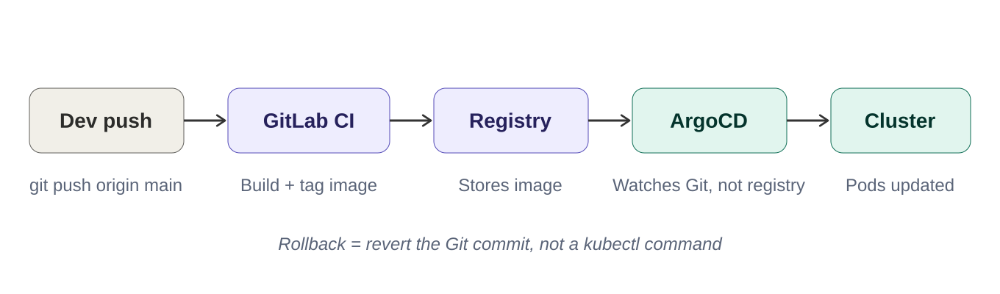
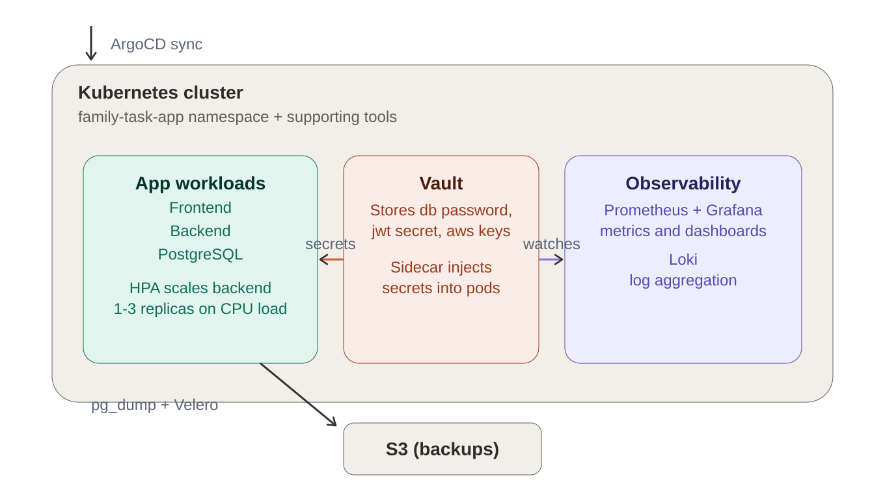
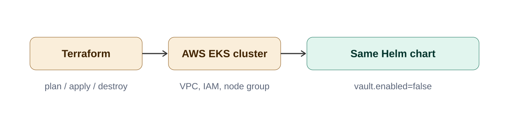

# Family Task App — DevOps Infrastructure Project

## Overview

A family task-management web app (users, tasks, family connections,
messaging) used as the vehicle for building and demonstrating a complete,
production-style DevOps stack — from a hand-built Kubernetes cluster through
GitOps, secrets management, observability, disaster recovery, and a real
cloud deployment via Terraform.

Two independent, fully working environments exist:
1. **Home-lab cluster** — 3-node on-prem Kubernetes, the primary environment
   with the full stack: GitOps, Vault, monitoring, backups, disaster recovery.
2. **AWS EKS cluster** — provisioned via Terraform, demonstrating
   Infrastructure as Code and managed cloud Kubernetes deployment.

> Note: earlier iterations of this project used Docker Compose, GitHub
> Actions, and Firebase Hosting. The project was later rebuilt on Kubernetes
> to demonstrate container orchestration, GitOps, and cloud infrastructure
> automation — the architecture below reflects the current, actual state.

## Architecture

**Home-lab cluster:**
- 3 VMware VMs: `node1` (RHEL10, control-plane), `node2` (RHEL9, worker),
  `node3` (Ubuntu, worker)
- Calico CNI, `local-path` StorageClass
- NGINX Ingress Controller

**AWS cluster:**
- Provisioned entirely via Terraform (VPC, subnets, IAM roles, EKS cluster,
  managed node group)
- Remote state in S3 with DynamoDB locking
- `gp2` EBS-backed storage via the AWS EBS CSI driver (IRSA-authenticated)

### Deployment Pipeline

### What's Running Inside the Cluster

### Cloud Provisioning Path

**[View the full evidence gallery →](docs/EVIDENCE.md)**

## Tech Stack by Phase

| Phase | Technology |
|---|---|
| 1 | Kubernetes (kubeadm, Calico) — 3-node cluster |
| 2 | Node/Express + PostgreSQL backend |
| 3 | Kubernetes manifests, NGINX Ingress, RBAC |
| 4 | Helm |
| 5 | Prometheus, Grafana, Loki (substituted for ELK) |
| 6 | ArgoCD (GitOps) |
| 7 | GitLab CI/CD |
| 8 | HashiCorp Vault |
| 9 | HPA, Velero, pg_dump-to-S3 backups, full DR drill |
| 10 | Terraform, AWS EKS |
| 11 | This documentation |

## Key Technical Decisions & Substitutions

- **Loki instead of ELK**: chosen for lower memory footprint on a
  resource-constrained 3-node home lab, and native Grafana integration.
  Tradeoff: ELK offers stronger full-text search; Loki is operationally
  simpler and lighter.
- **Alerting rules active, not routed to a notification channel**: dozens of
  real Prometheus alert rules are configured and evaluate continuously
  (viewable via Prometheus `/alerts` or Grafana Alerting), but external
  notification (Slack/email) was deliberately scoped out to avoid managing
  additional third-party credentials for this phase.
- **`gitlab-registry-cred` is not GitOps-managed**: Kubernetes requires
  `imagePullSecrets` to exist as a real object before a pod starts, which
  Vault Agent Injector cannot supply (it only injects into already-running
  pods). Discovered via the DR drill. Proper fix (future work): External
  Secrets Operator, which can sync a Vault secret into a real K8s Secret
  object automatically.
- **Helm chart supports a `vault.enabled` toggle**: the same chart deploys
  with full Vault Agent Injector integration (home-lab) or with plain
  Kubernetes Secrets (the EKS demo cluster, which doesn't run Vault).

## Real Problems Found and Fixed

- **Disk pressure on `node2`/`node3`** caused ArgoCD sync operations to fail
  silently; root-caused via `kubectl describe node` conditions, fixed by
  extending each VM's disk (LVM extend on RHEL, `growpart`+`resize2fs` on
  Ubuntu).
- **CI/CD image tagging bug**: a `sed` command wrapped in single quotes
  prevented bash variable expansion, causing literal
  `${CI_COMMIT_SHORT_SHA}` strings to be written into `values.yaml` instead
  of real commit hashes — silently breaking deploys until caught.
- **DR drill uncovered multiple GitOps gaps**: several resources
  (`family-task-app-sa`, `aws-backup-credentials`, `gitlab-registry-cred`)
  had been created manually outside of Git and were silently lost when the
  namespace was deleted during disaster-recovery testing. All were brought
  under Helm/Git management except `gitlab-registry-cred` (see above).
- **Plaintext secrets found in Git history**: a security review during
  cleanup discovered `dbPassword`, `jwtSecret`, and AWS credentials had been
  committed in plaintext. All were rotated and migrated to Vault-only
  storage; GitHub's push protection caught and blocked one instance in real
  time.
- **EKS EBS CSI driver / IRSA**: the managed node group's default IAM
  permissions were insufficient for dynamic volume provisioning due to IMDS
  hop-limit restrictions on newer EKS node AMIs. Resolved by implementing
  IAM Roles for Service Accounts (IRSA) — an OIDC identity provider, a
  scoped IAM role, and a trust policy binding it to the CSI driver's
  Kubernetes service account.

## Verified End-to-End

- **HPA**: a real synthetic load test produced live scale-up (1→2 replicas)
  and scale-down as load subsided.
- **Disaster Recovery**: full namespace deletion, automatic GitOps
  reconstruction via ArgoCD, and successful data restore from an S3-stored
  `pg_dump` backup — verified by confirming test data survived the full
  destroy-and-restore cycle.
- **Rollback**: confirmed that reverting a bad change in Git (not the
  cluster) causes ArgoCD to automatically apply the fix, with no manual
  `kubectl` intervention.
- **Cloud deployment**: the same Helm chart deployed successfully onto a
  real, Terraform-provisioned AWS EKS cluster.

## Known Limitations

- `gitlab-registry-cred` requires manual recreation after a full namespace
  wipe.
- Alerting rules are active but not routed to an external notification
  channel.
- The AWS EKS deployment does not include Vault, ArgoCD, or the monitoring
  stack — it demonstrates cloud provisioning and Helm deployment capability;
  the full production-style stack lives on the home-lab cluster.

## Cost Management

AWS resources (EKS control plane + EC2 worker nodes) are provisioned via
Terraform specifically so they can be reliably torn down with a single
`terraform destroy` command when not actively in use, keeping real cloud
spend minimal for a portfolio project.

## Rollback Testing (Phase 9)

Tested reverting a bad deployment via GitOps (editing Git, not the cluster
directly). Confirmed the core principle works: setting `frontend.replicas: 0`
in `values.yaml` and pushing caused ArgoCD to automatically scale the
frontend down with no manual `kubectl` intervention; reverting the value
back to `1` and pushing brought it back the same way.

**Finding during testing:** the GitLab CI pipeline rebuilds and re-tags
container images on every push to `main`, including config-only commits
that don't touch application code. This caused repeated merge conflicts in
`values.yaml` when manual edits and CI's automatic image-tag commits landed
close together. Future improvement: scope the CI pipeline's build stage to
only trigger on changes to `backend/` or `frontend/` source paths, not on
every push to `main`.
