# Evidence Gallery

Screenshots proving each major capability actually works — not just configured.

## Application

**Live app UI** — the actual running application, real data, no placeholders.
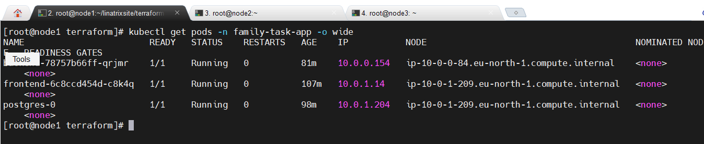

## Home-Lab Cluster

**Nodes healthy** — the 3-node on-premises cluster, all `Ready`.
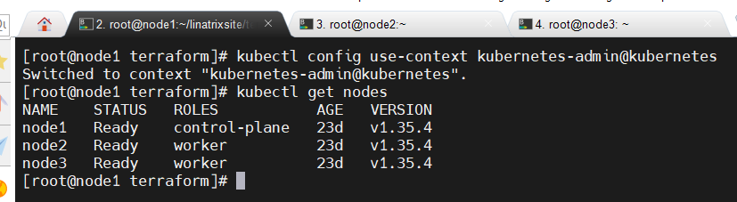

**Full stack running** — application pods, Helm release, and the full monitoring stack (Prometheus, Grafana, Loki) all healthy in one view.
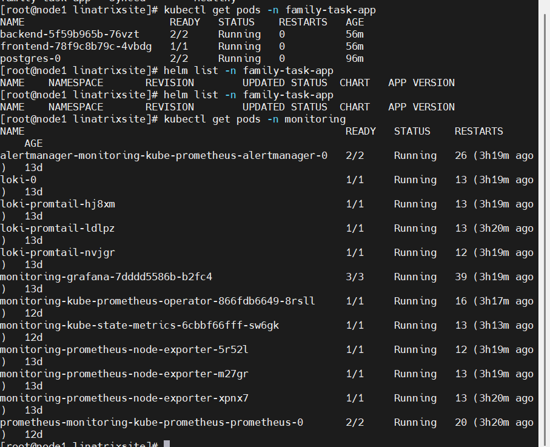

**ArgoCD sync status** — GitOps confirming the live cluster matches Git.
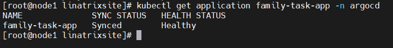

**ArgoCD, Vault, and HPA together** — sync healthy, Vault pods running, and the Horizontal Pod Autoscaler active with real targets.
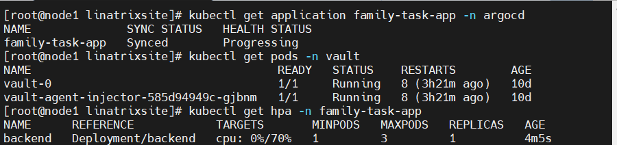

## Disaster Recovery

**Restored data, verified** — after a full namespace deletion and rebuild, the original test data is confirmed present and unchanged.
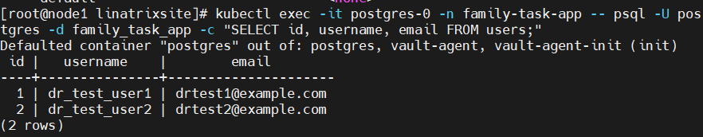

## AWS Cloud Deployment

**EKS cluster** — the real, Terraform-provisioned AWS EKS cluster.
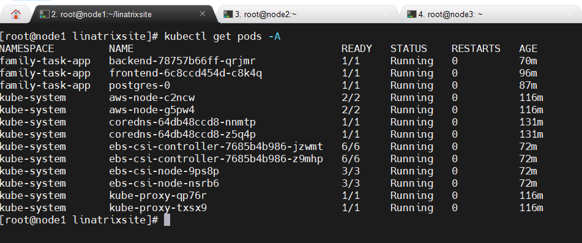

**EKS nodes** — the actual EC2 worker nodes, healthy and ready.
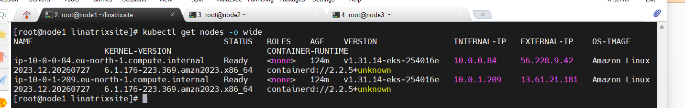

**Terraform state** — Terraform's own record of every resource it created.
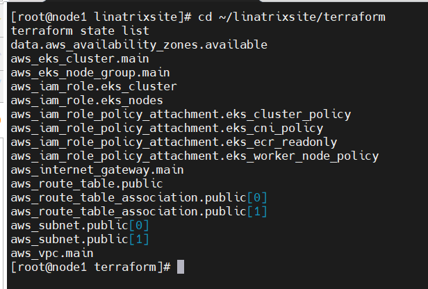

**Terraform outputs** — cluster name, endpoint, and region, confirmed post-apply.
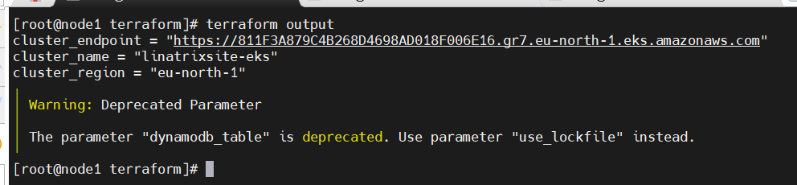

**AWS CLI confirmation** — resources verified independently of Terraform, directly via the AWS CLI.
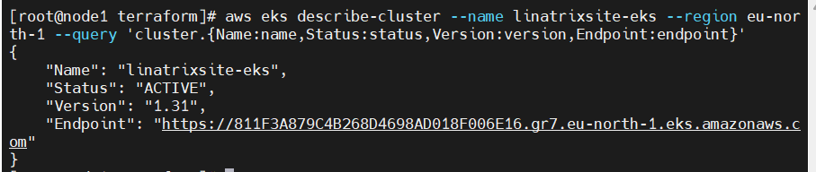
